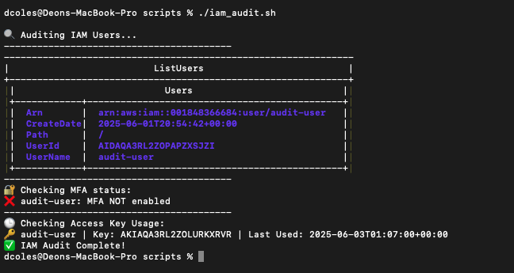
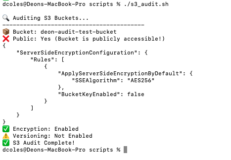
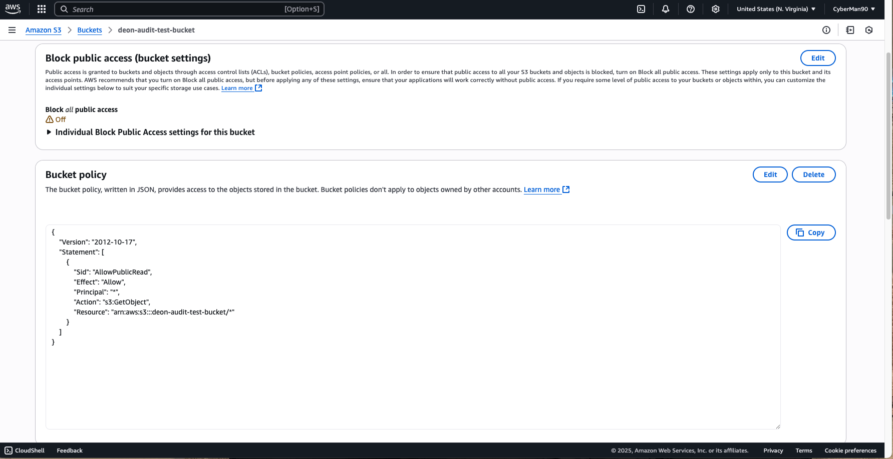
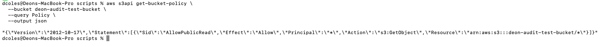

# ☁️ AWS Cloud Audit Toolkit (Security Checks)


This project simulates real-world cloud auditing tasks using AWS CLI and bash scripts. It's designed to help junior cloud security analysts and blue teamers practice identifying misconfigurations and weak security settings in AWS environments.

---

## 🧠 What You'll Learn

- How to enumerate IAM users and detect weak auth practices (no MFA, exposed keys)
- How to audit S3 buckets for public access and missing encryption
- How to analyze EC2 security groups for excessive open ports
- How to pull AWS Config snapshots to track compliance drift
- How to script audits using AWS CLI + Bash (SOC skills in automation!)

---

## 🗂️ Project Structure

```bash
cloud-audit-aws/
├── README.md
├── scripts/
│   ├── iam_audit.sh                # IAM audit: MFA, access keys, users
│   ├── s3_audit.sh                 # S3 audit: public, encryption, version
│   ├── ec2_sg_audit.sh             # EC2 security group open ports check
│   ├── config_snapshot.sh          # Downloads latest AWS Config snapshot
│   └── public_bucket_policy.json   # Used to test public S3 detection
├── screenshots/
│   ├── iam_audit_summary.png       # IAM audit results (MFA, keys)
│   ├── s3_bucket_list.png          # Bucket inventory in AWS console
│   ├── s3_public_access_ui.png     # UI showing public access warning
│   └── s3_bucket_empty.png         # Example: empty bucket created via CLI
```

🚧 **Note**: Two of four audit scripts are complete. EC2 and Config audits are in progress and will be added in a future update.

---

## 🔐 IAM Audit: Users, MFA & Access Keys

This audit script checks for common IAM misconfigurations and insecure practices.

### ✅ What It Checks:

1. **User Enumeration**
   - Lists all IAM users in the account.

2. **MFA Status**
   - Flags users who don’t have Multi-Factor Authentication (MFA) enabled.

3. **Access Key Activity**
   - Identifies active keys and when they were last used.

### 📸 Screenshot



### ⚠️ Why It Matters

- **No MFA** = easy phishing target.
- **Old keys** = attack surface that’s forgotten.
- **User enumeration** = crucial visibility for SOC triage and threat modeling.

> This script mimics a real SOC analyst task: scanning IAM hygiene in cloud environments for risk reduction.

---

## 📦 S3 Bucket Audit

The `s3_audit.sh` script audits all S3 buckets in the account:

- Detects **public buckets**
- Checks for **server-side encryption**
- Flags if **versioning is disabled**

---

### 🧪 Simulated Misconfiguration

To simulate a real-world issue, a public-read **bucket policy** was applied to a test S3 bucket. This helped validate that the audit script correctly detects insecure bucket configurations.

✅ Demonstrates the importance of restricting public access  
⚠️ Note: AWS now blocks **ACL-based** public permissions by default — so this test uses a **bucket policy** instead.

Additionally, an **empty S3 bucket** was created via CLI to verify visibility and basic configuration during enumeration.

---

### 📸 Screenshots

- 
- 
- 

---

## 🔐 EC2 Security Group Audit *(Coming Soon)*

> This script will scan AWS EC2 security groups for overly permissive rules (e.g. `0.0.0.0/0` for SSH, RDP) and surface risky configurations.

📌 **Goal**: Detect exposed services and flag misconfigured cloud firewalls.

🚧 **Status**: In progress – planned implementation in next update.

---

## 📋 AWS Config Snapshot *(Coming Soon)*

> This script will pull AWS Config compliance snapshots to help identify drift from security baselines and track changes to resources like S3, IAM, and EC2.

📌 **Goal**: Support GRC audits and continuous compliance monitoring.

🚧 **Status**: Script and demo coming soon.

---

## 🧪 Run All Scripts

Navigate into the `scripts/` directory and run:

```bash
chmod +x *.sh
./iam_audit.sh
./s3_audit.sh
./ec2_sg_audit.sh
./config_snapshot.sh
```

---

## 🛠️ Tools Used

- **AWS CLI** – Interact with AWS services via terminal
- **Bash** – Scripting automation for audits
- **IAM** – Identity and Access Management (users, MFA, access keys)
- **S3** – Storage bucket policies, encryption, and access control
- **EC2** – Analyze exposed ports in security groups
- **AWS Config** – Snapshots for compliance state tracking
- **Git & GitHub** – Version control and portfolio hosting

---

## 🧾 Final Notes

This project is designed as a hands-on SOC analyst simulation. Each script reflects the types of misconfigurations security teams often hunt for in real-world environments.

🔐 **IAM Audit** – Helps identify poor authentication practices  
📦 **S3 Audit** – Detects public buckets and missing encryption  
🌐 **EC2 Audit** – Surfaces exposed services and overly permissive firewalls  
📋 **Config Snapshot** – Supports compliance and audit trail preservation  

🔐 IAM misconfigurations are one of the top causes of cloud breaches — catching missing MFA and stale credentials helps prevent privilege escalation and account takeover.

🧠 These scripts are also expandable. You can integrate them with cron jobs, SIEM ingestion, or alerting systems as your skills grow.

> “Cloud security isn’t just configuration… It’s verification.”

---

## 👨🏽‍💻 Author

**Deon Coles**  
GitHub: [CyberMan90](https://github.com/CyberMan90)  
Email: deon.l.coles@gmail.com  
LinkedIn: [linkedin.com/in/deoncoles](https://linkedin.com/in/deoncoles)

🚀 Passionate about cybersecurity, automation, and building real-world skills through hands-on labs and detection engineering.
