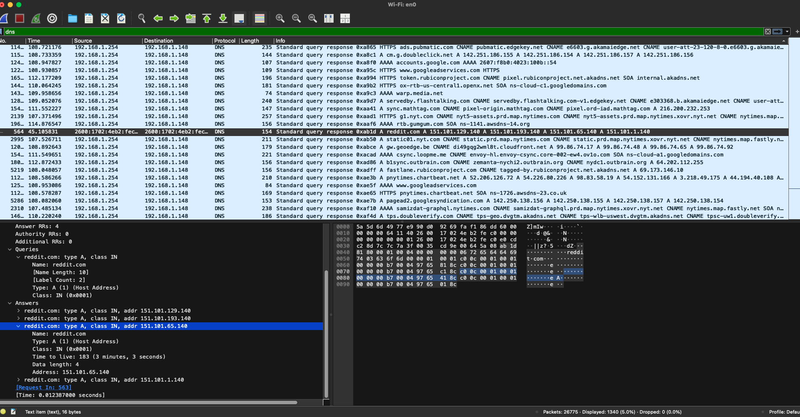
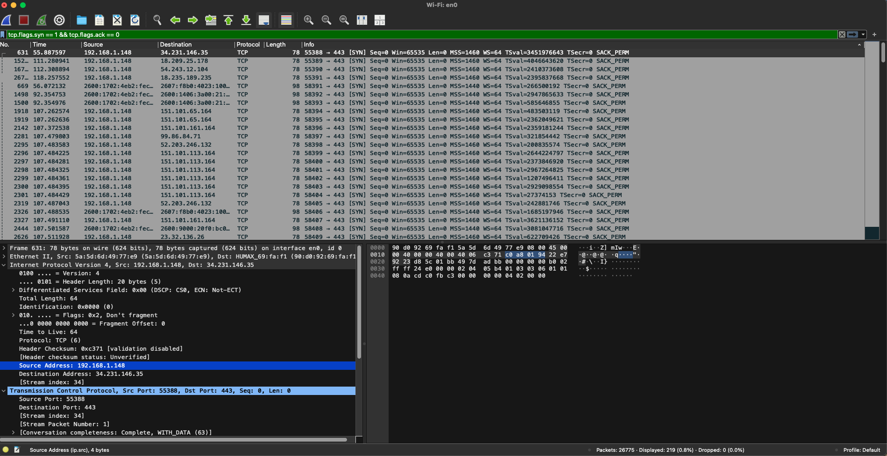
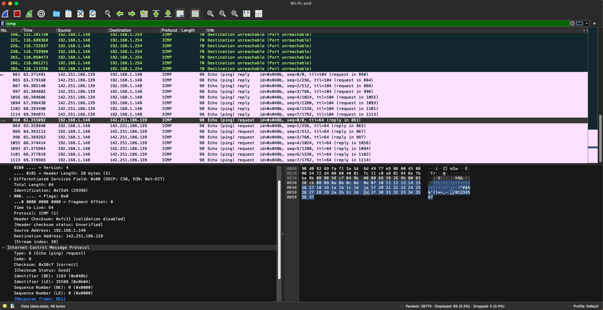
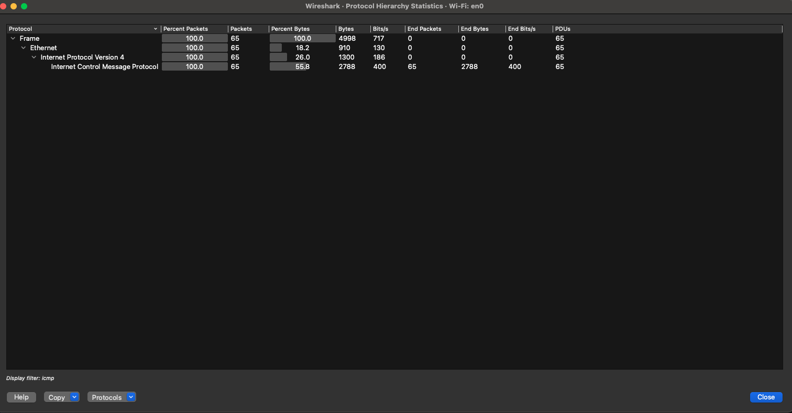

# 🕵️ Network Traffic Analysis (Wireshark)

## 🔍 Objective
Capture and analyze live network traffic using Wireshark. Apply filters to extract DNS queries, HTTP traffic, TCP handshakes, and ICMP messages to understand baseline network behavior.

---

## 🧰 Tools Used
- Wireshark
- macOS Terminal (for ping)
- Custom network activity (browser + ping commands)

---

## 🛠️ Methodology

1. **Capture Setup**
   - Selected the active Wi-Fi interface in Wireshark
   - Captured live traffic while browsing websites and using `ping` to generate ICMP packets

2. **Filters Applied**
   - `dns` — View domain resolution requests
   - `http` — Analyze unencrypted HTTP traffic
   - `icmp` — Inspect ping traffic
   - `tcp.flags.syn == 1 && tcp.flags.ack == 0` — Identify new TCP connections

3. **Packet Inspection**
   - Followed DNS query/response for `reddit.com`
   - Observed TCP SYN requests during browser activity
   - Reviewed Protocol Hierarchy and Endpoints for traffic summary

---

## 🧠 Key Findings
- DNS query for `reddit.com` resolved to IP: `151.101.65.140`
- Verified ICMP request/reply structure using ping to `google.com`
- No HTTP credentials or sensitive data found in this capture
- No evidence of suspicious domains or scanning behavior

---

## 📸 Screenshots

### DNS Query

### TCP SYN Packet

### ICMP Ping

### Protocol Hierarchy

